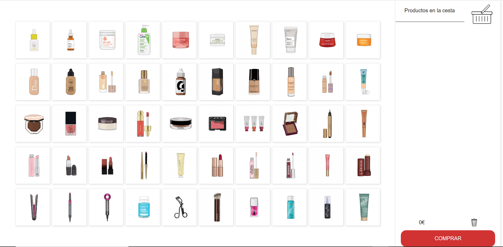
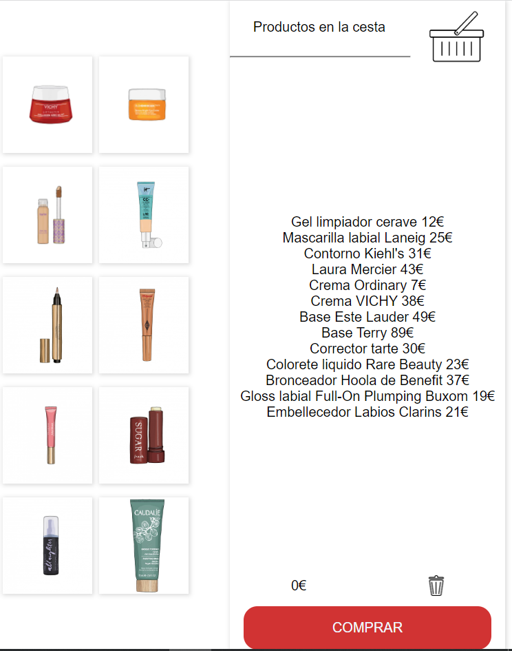

# ShowCase Makeup
El objetivo del proyecto es realizar un showcase de cosméticos con carrito de compra. 
Fecha de inicio del proyecto el 20 de septiembre de 2022 y fecha entrega del proyecto 30 de septiembre de 2022.

## Comenzando 🚀
### Funcionamiento
El funcionamiento consiste en que cada uno de los productos tiene un precio determinado y con la función drag and drop podemos arrastrar el cosmético a la cesta y se van sumando los precios. 
El precio final de la cesta se puede borrar pulsando en la papelera. También al hacer clic en cada uno de los productos aparece el nombre en la lista de productos. Al pulsar en comprar aparece una ventana emergente con un mensaje.   

 

 En esta imagen vemos como al pasar el ratón por los productos hace efecto zoom y la lista de productos en la cesta. 

## Construido con 🛠️
Proyecto creado con: 
 
 

## Bugs conocidos de la aplicación
Podemos encontrar que al presionar dos veces o más sobre un producto no queda estéticamente bien y si presionas sobre muchos sobrepasa el div donde están.

## Cambios a futuro ⌨️
Primero me gustaría mejorar el diseño de la aplicación, por otra parte me gustaría que al arrastrar el producto a la cesta a la vez aparezca el nombre del producto en la lista de la compra, igual que si lo arrastras más de una vez, te aparezca el nombre multiplicado. 

## Recursos Externos 📦

Las imágenes están descargadas de https://metabeauty.info/index.php encontradas a través de Pinterest. 

## Autor ✒️
Paula Almiñana Adrover 

